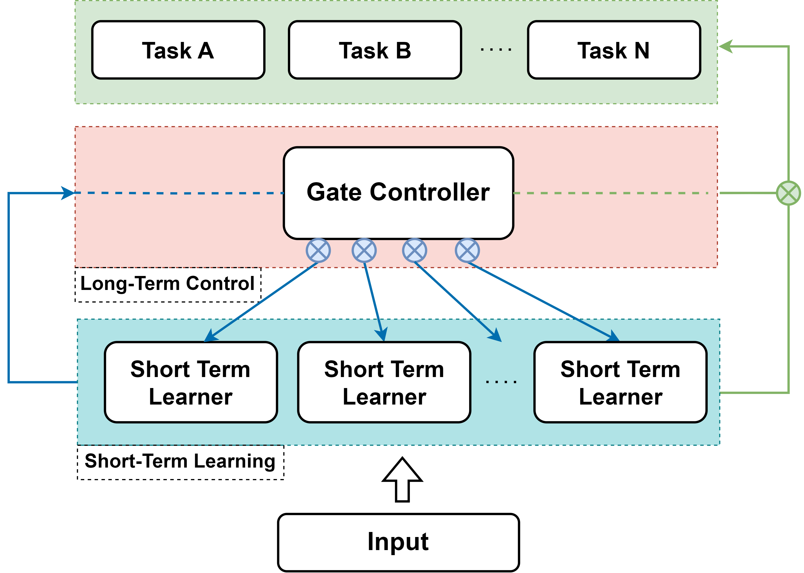

# LSTOL

*We are currently finalizing this repository to coincide with the upcoming IROS paper.*

This repository contains the implementation of the Long-Short-Term Online Learning (LSTOL) method proposed in our [IROS 2024](https://iros2024-abudhabi.org/) paper entitled " Preventing Catastrophic Forgetting in Continuous Online Learning for Autonomous Driving".

## Abstract

Autonomous vehicles require online learning capabilities to enable long-term, unattended operation. However, long-term online learning is accompanied by the problem of forgetting previously learned knowledge. This paper introduces an online learning framework that includes a catastrophic forgetting prevention mechanism, named Long-Short-Term Online Learning (LSTOL). The framework consists of a set of short-term learners and a long-term controller, where the former is based on the concept of ensemble learning and aims to achieve rapid learning iterations, while the latter contains a simple yet efficient probabilistic decision-making mechanism combined with four control primitives to achieve effective knowledge maintenance. A novel feature of the proposed LSTOL is that it avoids forgetting while learning autonomously. In addition, LSTOL makes no assumptions about the model type of short-term learners and the continuity of the data. The effectiveness of the proposed framework is demonstrated through experiments across well-known datasets in autonomous driving, including KITTI and Waymo.

## Method Overview



## Setup

```
What needs to be installed?
```

## Getting Started

```
How to run this stack?
```

## Citation

If you find our code or paper useful for your research, please cite:
```bibtex
@inproceedings{yr24iros,
  title={Preventing Catastrophic Forgetting in Continuous Online Learning for Autonomous Driving},
  author={Rui Yang and Zhi Yan and Tao Yang and Tomas Krajnik and Yassine Ruichek},
  booktitle={2024 IEEE/RSJ International Conference on Intelligent Robots and Systems (IROS)},
  pages={},
  year={2024}
}
```
